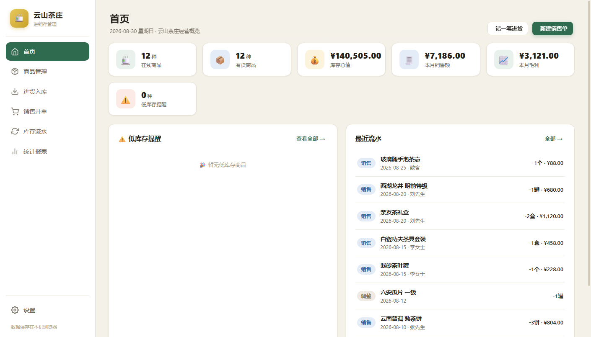
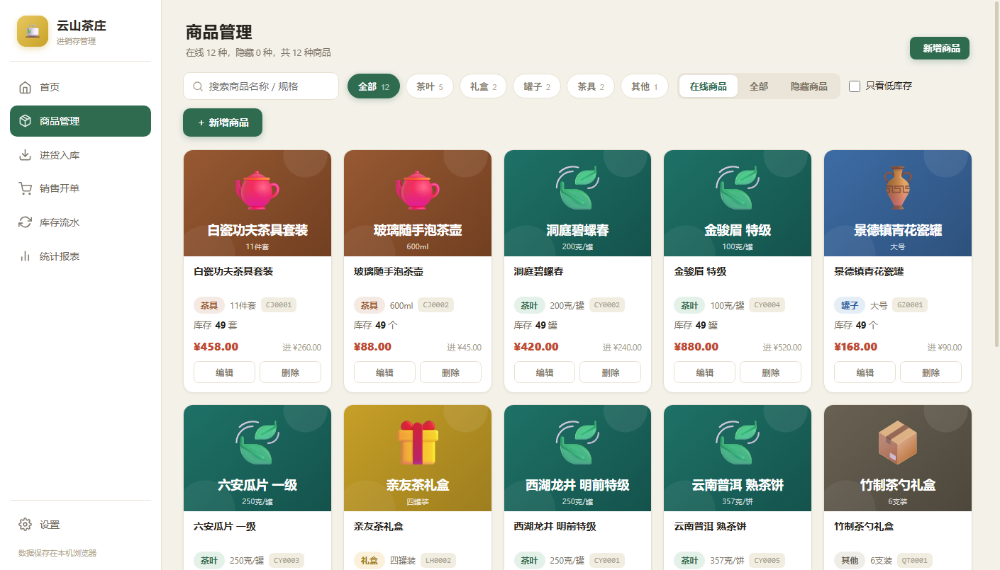
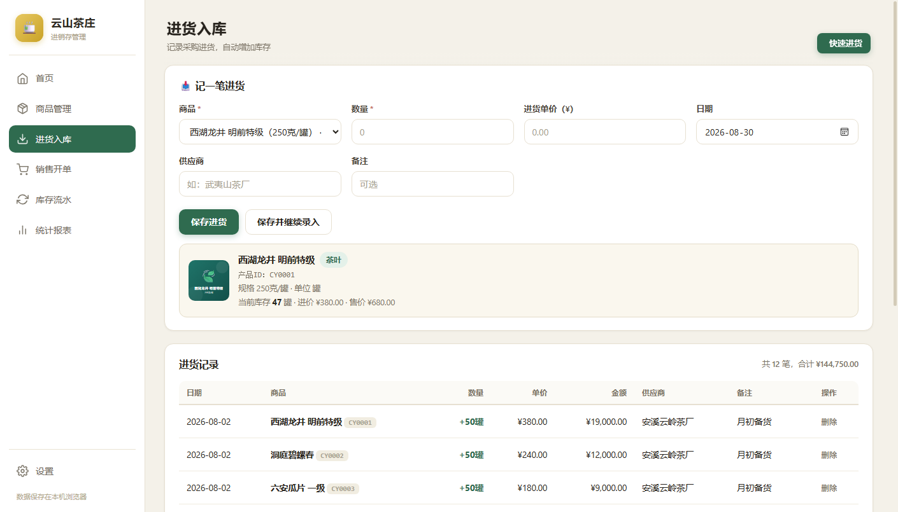
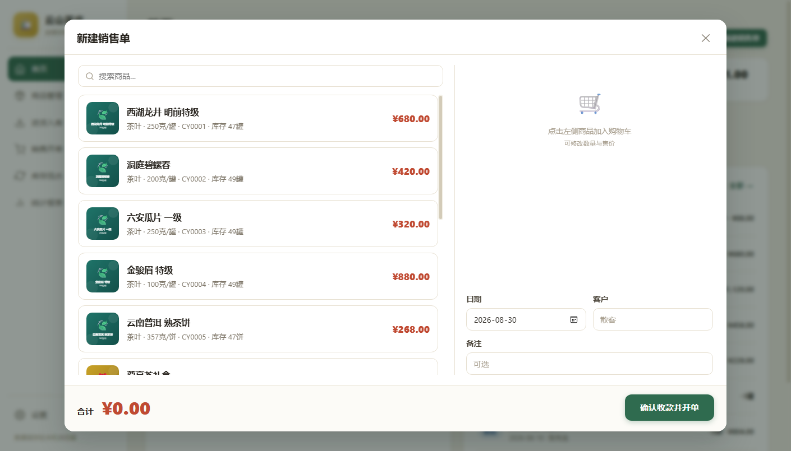
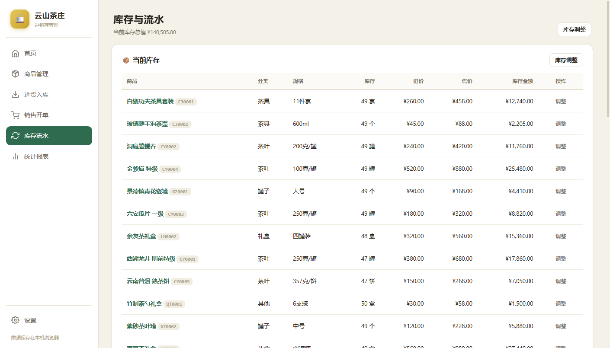
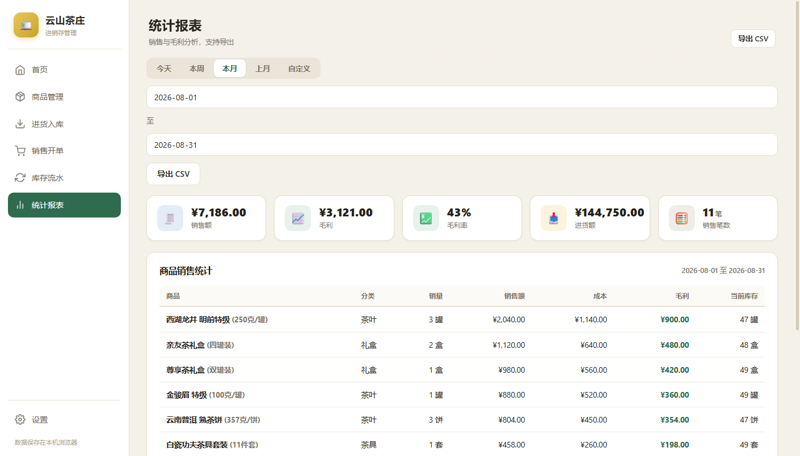
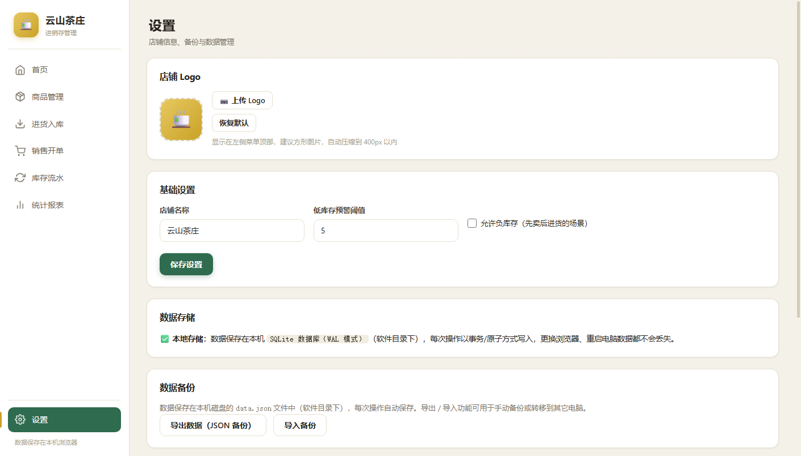

# 🍵 茶店进销存

一款专为茶叶店设计的**进销存管理软件**，纯本地运行、无需联网、无需安装数据库。
支持商品图片（茶叶 / 礼盒 / 罐子 / 茶具），清爽雅致的茶色系界面。

## 使用方法（务必用方式二，数据才保存在本地磁盘）

### 方式：启动本地服务（数据存磁盘，推荐 / 必须）
1. 确保电脑已安装 [Node.js](https://nodejs.org/)（如果没有，先安装，安装后重新打开命令窗口）。
2. 双击 `start.bat`，浏览器会自动打开 `http://localhost:8080`。
3. **所有数据自动保存到本机磁盘文件 `data.json`**（软件目录下）：每次操作自动写入，更换浏览器、重启电脑数据都不丢失。
4. 关闭黑色窗口即停止服务。

> ⚠️ 直接双击 `index.html` 打开时数据只存在浏览器里（临时存储），**关闭浏览器或更换浏览器会丢失**，页面顶部会有醒目提示。请务必通过 `start.bat` 启动。

## 功能一览

| 模块 | 说明 |
| --- | --- |
| 首页 | 经营概览：在线商品、库存总值、本月销售额 / 毛利、低库存提醒、最近流水 |
| 商品管理 | 新增 / 编辑 / 删除商品，**自动生成产品ID**（茶叶 CY / 礼盒 LH / 罐子 GZ / 茶具 CJ / 其他 QT + 序号，一眼可辨类别）；支持**上传商品图片**、分类筛选、搜索、只看低库存、**在线 / 全部 / 隐藏**三种显示范围；可**隐藏停售或过期商品** |
| 进货入库 | 选择商品后**自动展示该商品详情（含图片、ID、规格、当前库存、进价售价）**，避免同名商品选错；记录进货自动增加库存并记忆最新进货价 |
| 销售开单 | POS 风格快速开单：搜索商品加入购物车、改数量改价格、自动扣库存；开单后可**打印小票**；销售记录支持**查看详情**（每种商品的图片、名称、ID、规格、数量、单价、金额） |
| 库存流水 | 当前库存表（含产品ID）+ 全部出入库流水，可按类型 / 日期 / 关键字筛选，支持**库存调整**（盘点、破损等） |
| 统计报表 | 按今天 / 本周 / 本月 / 上月 / 自定义区间统计销售额、毛利、进货额，商品销售排行，可**导出 CSV** |
| 设置 | **自定义店铺 Logo**（侧边栏顶部展示）、店铺名称、低库存阈值、允许负库存、**数据备份导出 / 导入恢复**（含图片与 Logo）、清空数据 |

## 系统截图（演示数据）

首页 · 经营概览



商品管理（支持图片、分类、隐藏停售商品）



进货入库（选中商品自动展示详情）



销售开单（POS 快速开单）



库存流水（当前库存 + 出入库流水）



统计报表（销售额 / 毛利 / 商品排行）



设置（Logo、店铺信息、数据备份）



## 数据安全提示

- **主存储：SQLite 数据库（`data.sqlite`，WAL 模式）**。商品、库存、进货流水、销售流水、调整流水分表存储，流水表对时间/商品ID/单号建索引。
- **事务保证**：库存与流水在同一事务内修改（卖一单 = 减库存 + 记流水，要么全部成功要么全部回滚），服务器端还会校验库存不足并整单拒绝。
- **逐操作写入**：每次业务操作单独写入（不再整包覆盖文件），多标签页并发不再互相覆盖。
- **商品图片不内嵌数据库**：保存为 `images/` 目录独立文件（数据库只存路径）。
- **每日自动备份**：`backups/` 目录（SQLite 一致性快照 `data-日期.sqlite`），自动清理 30 天前旧备份。
- **一键回退**：如遇异常，可设置环境变量 `STORAGE=json` 启动，回到 `data.json` 存储（数据仍在，只是不再更新）。
- 旧版 `data.json` 在迁移后**保留不删除**，作为历史存档。
- 建议定期在「设置 → 导出数据」保存一份 JSON 备份；换电脑时拷贝整个 `tea-shop-inventory` 文件夹，或用「导入备份」恢复。

## 目录结构

```
tea-shop-inventory/
├── index.html          # 主页面
├── css/style.css       # 界面样式
├── js/db.js            # 浏览器存储层（仅直接双击打开时的兜底）
├── js/app.js           # 业务逻辑
├── server.js           # 本地服务器 + HTTP API（数据核心）
├── storage-sqlite.js   # SQLite 存储层（WAL、四表、事务）
├── storage-json.js     # JSON 回退存储层（STORAGE=json 时启用）
├── scripts/
│   ├── migrate-lib.js      # 迁移共用库
│   ├── migrate-images.js   # 图片分离脚本：node scripts/migrate-images.js
│   └── migrate-sqlite.js   # JSON→SQLite 迁移脚本：node scripts/migrate-sqlite.js
├── data.sqlite         # ★ 主数据库（自动生成，WAL 模式）
├── data.json           # 历史 JSON 存档（迁移后保留；回退模式才更新）
├── images/             # 商品图片与 Logo 的独立文件（自动生成）
├── backups/            # 每日自动备份 + 迁移前备份（自动生成）
└── start.bat           # Windows 一键启动脚本
```
